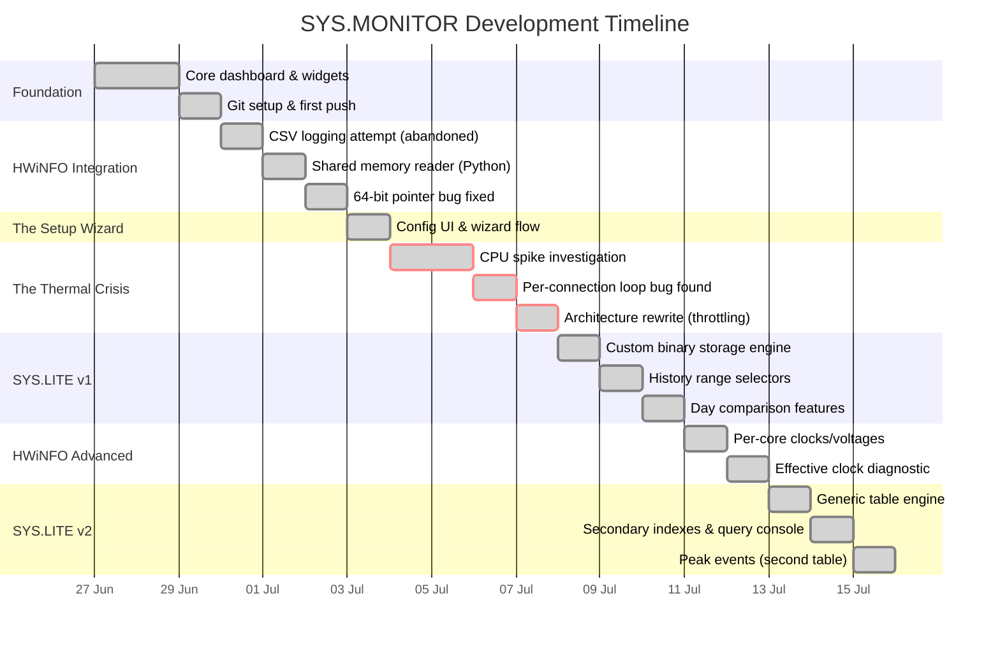
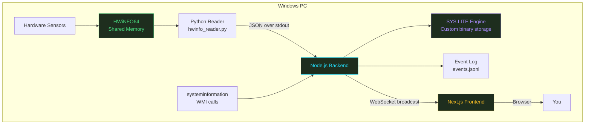
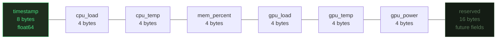
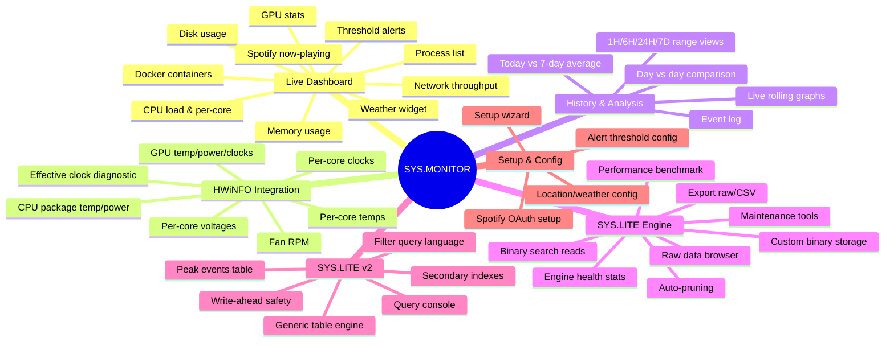

# SYS.MONITOR — Project Documentation

**A self-hosted, real-time system monitoring dashboard for Windows, built from scratch as a learning project.**

---

## Table of Contents

1. [Overview](#overview)
2. [Timeline](#timeline)
3. [Architecture](#architecture)
4. [The Journey](#the-journey)
5. [Key Technical Decisions](#key-technical-decisions)
6. [Major Problems & Resolutions](#major-problems--resolutions)
7. [Feature Inventory](#feature-inventory)
8. [Known Limitations](#known-limitations)
9. [File Structure](#file-structure)

---

## Overview

SYS.MONITOR started as a casual idea — "I could build my own Grafana-style dashboard for my own PC" — and grew, over roughly 7-10 days of evening/weekend development, into a genuinely full-featured system monitoring tool with its own custom database engine, direct hardware sensor integration, and a growing set of analytical features.

It was built with AI pair-programming assistance (Claude) throughout, by someone new to full-stack development, working around a full-time job. That context matters for reading this document: the value here isn't just the finished product, but the debugging process, the architectural decisions made under real constraints (no build tools, no native compilation, wanting to understand every layer), and the iteration that got from "basic dashboard" to "self-hosted observability platform with its own storage engine."

**Stack at a glance:**
- Backend: Node.js + TypeScript
- Frontend: Next.js 15 (React 19) + TypeScript
- Communication: raw WebSocket
- Storage: a custom-built binary time-series engine (no external database)
- Hardware access: HWiNFO64 shared memory via a Python bridge process
- Deployment: 100% local, `127.0.0.1` only

---

## Timeline



---

## Architecture

### System Overview



### The Metrics Collection Loop

This is the piece that changed the most over the project's life — see [The Thermal Crisis](#the-thermal-crisis) below for why.

```mermaid
sequenceDiagram
    participant Tab1 as Browser Tab
    participant Loop as Single Shared Loop
    participant Collectors as Throttled Collectors
    participant HWiNFO as HWiNFO (cheap)
    participant WMI as systeminformation (expensive)

    Tab1->>Loop: Connect (starts loop if not running)
    loop Every ~2s
        Loop->>Collectors: Request current data
        Collectors->>HWiNFO: Refresh if stale (every ~1s)
        Collectors->>WMI: Refresh if stale (every 5-30s)
        Note over Collectors: If not stale, return<br/>cached value —<br/>underlying call<br/>NEVER fires
        Collectors-->>Loop: Combined payload
        Loop-->>Tab1: Broadcast (same payload to ALL clients)
    end
    Tab1->>Loop: Disconnect
    Note over Loop: If no clients remain,<br/>loop pauses entirely
```

### SYS.LITE Storage Engine — Record Layout

The core metrics table uses a fixed 48-byte binary record:



Reads use **binary search directly on the file** — no loading the whole dataset into memory, no external database process. A benchmark run on real project data showed binary search completing a lookup in **0.091ms** (14 comparisons) versus **9.2ms** (5,382 comparisons) for a naive linear scan — a **101.5× speedup**, at just over 13,000 records.

---

## The Journey

### Phase 1 — Foundation (Day 1-2)

Started from a basic idea sketched out during a work shift: a dark-terminal-aesthetic system monitor, inspired loosely by Grafana but self-contained. Built the core dashboard shell first — CPU, memory, GPU, disk, network, process list, Docker stats — all pulling from the `systeminformation` npm package, pushed to the browser over a WebSocket every 2 seconds.

Early wins: draggable/resizable widget grid (`react-grid-layout`), multi-page support with auto-rotation, layout persistence to `localStorage`.

Early pain: git hygiene. `node_modules` and multi-hundred-MB zip files ended up committed to the repo before a proper `.gitignore` existed, requiring `git filter-branch` to strip them back out of history — a good early lesson in what belongs in version control.

### Phase 2 — HWiNFO Integration

`systeminformation`'s sensor reads (`si.cpuTemperature()`, `si.graphics()`, `si.fan()`) turned out to be unreliable on the actual hardware — nulls, missing GPU power draw, required admin rights. HWiNFO64 was already known to give accurate readings, so the question became: how to get that data into Node.js.

First attempt: CSV logging from HWiNFO, tailed by the backend. Worked, but required constant file writes and felt clunky.

Real solution: HWiNFO exposes a **shared memory segment** (`Global\HWiNFO_SENS_SM2`) that any process can read directly. A persistent Python child process (`hwinfo_reader.py`) uses `ctypes` to map that memory and parse the sensor structures, printing JSON to stdout every couple of seconds. Node reads those lines via `readline`.

This had its own debugging arc — a 64-bit pointer truncation bug (`ctypes` defaulting to 32-bit return types on `MapViewOfFile`, causing `access violation` crashes) took several rounds of raw memory dumps to isolate and fix by explicitly setting `restype = ctypes.c_void_p`.

### Phase 3 — Setup Wizard

Realized that hand-editing a `config.ts` file wasn't a sustainable way to configure the app for anyone else (or future-self). Built a multi-step setup wizard: location (with geocoding search), Spotify OAuth credentials, alert thresholds. The wizard POSTs to the backend, which writes a generated `config.ts` file directly (an unconventional choice — more typical would be JSON or `.env`, but it matched the existing pattern of everything being TypeScript).

### The Thermal Crisis

This was the single longest and most important debugging arc of the whole project, so it gets its own section — see below.

### Phase 4 — SYS.LITE v1

Wanted persistent history (surviving backend restarts) without a real database. `better-sqlite3` required native compilation via Visual Studio Build Tools, which wasn't something to install just for this. `node:sqlite` (built into Node 22+) was considered, but ultimately a **custom binary time-series engine** was built instead — partly practicality, partly as a deliberate "I want to understand every byte of this" exercise.

Result: fixed 48-byte records, append-only, binary search for range queries, downsampling for long ranges, auto-pruning after 7 days.

### Phase 5 — Historical Features

Built on top of SYS.LITE: a range selector (`LIVE / 1H / 6H / 24H / 7D`) on the live graphs, a "Today vs 7-Day Average" comparison widget, and a "Day vs Day" picker letting you compare any two specific calendar days side by side.

### Phase 6 — HWiNFO Advanced Widgets

Extended the HWiNFO reader to pull per-core clock speeds, multipliers, VIDs (voltage), and — most usefully — **effective clock** (the real utilized frequency per core versus nominal boost clock), which is a genuine diagnostic signal for spotting unexpected idle-state behavior under load.

### Phase 7 — SYS.LITE v2: A Real Engine

The most ambitious phase. Extended SYS.LITE from "one hardcoded table" into a genuinely generic engine:

- A `Table` class that accepts any schema (not just the original 6 metric fields)
- **Write-ahead safety** — detects and truncates torn/partial records left by a crash mid-write
- **Secondary indexes** — sorted lookup structures for fast top-N and filtered queries on any field
- A small **filter query language** (`value > 70 AND metric == 2`) — deliberately not real SQL, but a real, working predicate engine
- **Peak Events** — a second table, built on the same engine, that automatically logs whenever CPU/GPU load or temp beats its session high. A genuine showcase for the secondary index: "show me my top 10 hottest GPU moments ever."
- A standalone `/syslite` admin page: engine health stats, a raw record browser, a self-describing "how it works" diagram generated live from the actual code constants (so it can never go stale), the performance benchmark, maintenance tools with a real confirm-before-delete flow, and data export (raw binary or CSV).

---

## Key Technical Decisions

| Decision | Alternative Considered | Why This Choice |
|---|---|---|
| Custom binary storage (SYS.LITE) | SQLite (`better-sqlite3` or `node:sqlite`) | Avoided native compilation risk entirely; deliberate learning exercise; purpose-built for exactly 6 known fields rather than general-purpose flexibility |
| HWiNFO shared memory via Python | `systeminformation` WMI sensor calls | WMI sensor reads were unreliable/null on the target hardware and required admin rights; shared memory is the same interface used by Rainmeter and similar tools |
| Single shared metrics loop | One loop per WebSocket connection (original) | The original design multiplied system load by the number of open browser tabs — root cause of the thermal crisis |
| Persistent Python process | Spawning Python fresh per poll | Spawning a new interpreter every cycle added real, measurable overhead; a long-lived process reads shared memory cheaply on a loop instead |
| Generated `config.ts` file | JSON or `.env` config | Matched the existing all-TypeScript pattern; trade-off is coupling the setup wizard's output format to the backend's module system |
| Simple filter language, not SQL | A real SQL parser | Honest about scope — one field, one operator, one combinator per query — rather than over-building a feature that wouldn't be used to its full extent |

---

## Major Problems & Resolutions

### The Thermal Crisis

**Symptom:** Running the dashboard caused the CPU to spike to sustained 40-50% load and, on a 14700KF, thermal-throttle to 100°C — from a monitoring tool that should have been near-idle.

**What didn't work (several rounds):**
- Disabling the process list collector — helped a little, not enough
- Increasing the WebSocket poll interval — reduced frequency, not the underlying cost
- Adding "throttle" logic that skipped *using* an expensive collector's result on some ticks — **this didn't reduce the actual system-call cost at all**, because the expensive function was still being *called* every tick regardless; only the display was being cached

**Root cause, eventually found:** the WebSocket connection handler spawned its own `setInterval` **per connection**. Every open browser tab ran a fully independent copy of the entire metrics collection pipeline. Two tabs open meant twice the WMI load; a stray duplicate connection from dev-mode hot reload made it worse still.

**Real fix:** rearchitected to a single shared collection loop for the whole server, with a `refreshIfStale()` wrapper around each collector that **skips calling the underlying function entirely** when its refresh interval hasn't elapsed — not just skips displaying a new result. The loop also now pauses completely when no client is connected.

**Result:** confirmed via before/after CPU graphs showing sustained 40-50% load dropping to a near-flat low baseline immediately after the fix landed.

**Lesson:** when a fix doesn't hold after several attempts, the right move is to stop optimizing inside the function and start asking how many places are calling it.

---

### The Stale-Zip Regression

**Symptom:** After building new History/SYS.LITE features on top of what seemed like the current codebase, previously-fixed bugs reappeared — the old, expensive WMI-based GPU/temp collectors were back, and the GPU widget was reading from the wrong field again.

**Root cause:** the local zip file used as a base for that round of changes actually predated the thermal-crisis architecture fix. The changes were built correctly on top of *that* file — but that file itself was already out of date.

**Fix:** re-derived the actual current state directly from the GitHub `master` branch (downloaded as a fresh zip from the repo) rather than trusting a locally-provided file whose currency hadn't been verified, then reapplied the new feature work on top of the *real* current state.

**Lesson:** "I have a file" isn't the same as "I have the current file" — when in doubt, check against the source of truth (the actual pushed repo), not whatever's sitting in a local folder.

---

### The HWiNFO 64-bit Pointer Bug

**Symptom:** The Python shared-memory reader script ran without crashing but produced no output at all — no error, no data, just silence.

**Root cause:** `ctypes.windll.kernel32.MapViewOfFile()` defaults to returning a 32-bit integer on 64-bit Windows unless explicitly told otherwise, silently truncating the real memory address. Reading from the truncated (wrong) address caused an `access violation` that manifested as a hang rather than a clean error.

**Fix:** explicitly setting `MapViewOfFile.restype = ctypes.c_void_p` (and the same for `OpenFileMappingW`) forces `ctypes` to preserve the full 64-bit pointer.

**Lesson:** silent failures in low-level memory access are often a type/size mismatch, not a logic bug — dumping raw bytes and checking types explicitly resolved in minutes what black-box debugging couldn't.

---

### The Filter Parser Bug

**Symptom:** The SYS.LITE query console returned all records regardless of the filter typed in (`metric == 2 AND value > 70` returned everything, unfiltered).

**Root cause:** `part.split(opRegex)` on a regex with a capturing group returns **three** elements (`[field, operator, value]`), but the code destructured only the first two (`const [field, valueStr] = ...`) — so `valueStr` was actually capturing the operator string itself (e.g. `"=="`). `parseFloat("==")` is `NaN`, so the clause was silently dropped, leaving an empty filter that matched everything.

**Fix:** explicitly index the array (`segments[0]` for field, `segments[segments.length - 1]` for value) instead of relying on array destructuring assumptions.

**Lesson:** `.split()` with a capturing regex group is a common source of "off by one element" bugs — worth testing the actual split output before assuming its shape.

---

### The HWiNFO 12-Hour Free-Tier Limit

**Symptom:** GPU and temperature data would silently stop updating roughly twice a day.

**Root cause:** HWiNFO's free version limits "Shared Memory Support" to 12-hour sessions before it needs re-enabling — confirmed via research to have been introduced starting HWiNFO v7.00 (v6.43 Beta was the last version without it, but that release predates the project's actual CPU/GPU hardware and lacks sensor support for them, ruling out a version downgrade as a fix).

**Status:** not fully resolved — options considered were purchasing an HWiNFO Pro license (removes the limit) or building a watcher that detects the drop and programmatically restarts HWiNFO. Left as an open task, intentionally scoped separately from the core dashboard work.

---

## Feature Inventory



---

## Known Limitations

Documented honestly, not glossed over:

- **No enforced authentication** — the setup wizard collects a password field, but nothing currently checks it
- **No working 2FA** despite UI scaffolding suggesting it exists
- **Alerts are visual-only** — no OS notification, email, or webhook when a threshold is crossed
- **HWiNFO's 12-hour free-tier limit** remains an open, unresolved operational annoyance
- **Single-machine only** — no support for monitoring other devices from one dashboard
- **No automated tests** anywhere in the codebase
- **`config.ts` written as generated source code** rather than JSON/env — works, but couples the setup wizard's output format to the backend's module system in an unconventional way
- **The query filter language is intentionally limited** — one combinator per query, no nested logic, not real SQL

---

## File Structure

```
project/
├── backend/
│   ├── src/
│   │   ├── collectors/          # systeminformation-based metric collectors
│   │   ├── engine.ts            # Generic SYS.LITE v2 table engine
│   │   ├── peaks.ts             # Peak Events table (built on engine.ts)
│   │   ├── db.ts                # Original SYS.LITE metrics storage
│   │   ├── events.ts            # Event log (JSON lines)
│   │   ├── hwinfo_reader.py     # Persistent HWiNFO shared memory reader
│   │   ├── setup.ts             # Setup wizard backend logic
│   │   ├── config.ts            # Generated config (gitignored)
│   │   └── index.ts             # WebSocket server + metrics loop
│   └── package.json
├── frontend/
│   ├── src/
│   │   └── app/
│   │       ├── page.tsx         # Main dashboard
│   │       ├── setup/           # Setup wizard UI
│   │       └── syslite/         # SYS.LITE engine admin page
│   └── package.json
└── setup.ps1                    # Install / build / launch script
```

---

*This document reflects the state of the project as of the most recent development session. Given the pace of iteration, treat it as a snapshot rather than a permanently current reference.*
